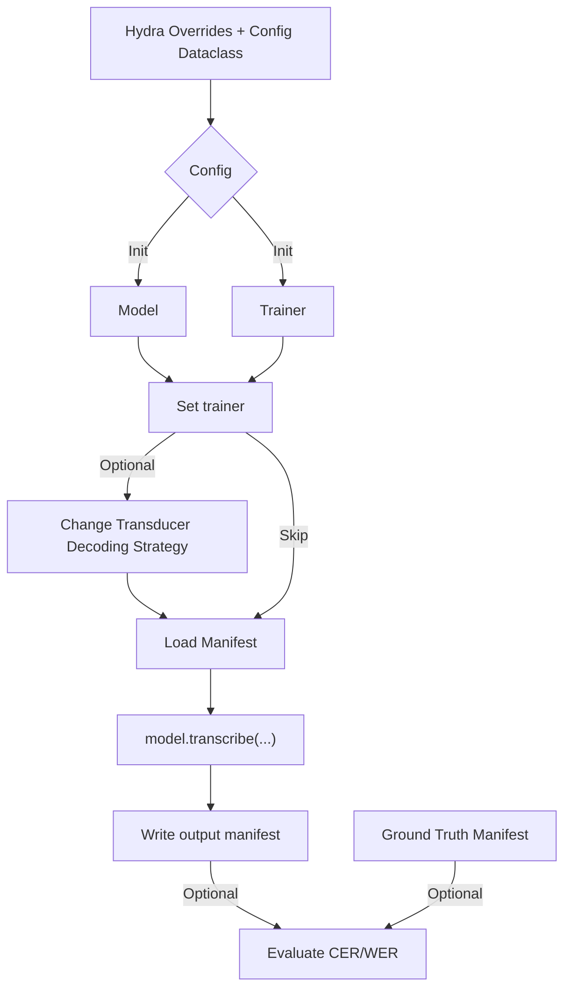

# Voice recognition 
Implementation of various architectures that are available online and determine the model that best performs the "predefined goal" of the project.

## System requirements
* python = 3.9.xx
* torch = 

## Inference steps guideline 

During restoration of the model, you may pass the Trainer to the restore_from / from_pretrained call, or set it after the model has been initialized by using model.set_trainer(Trainer).
